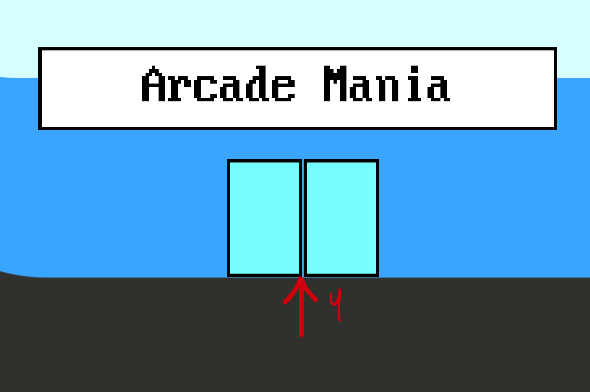
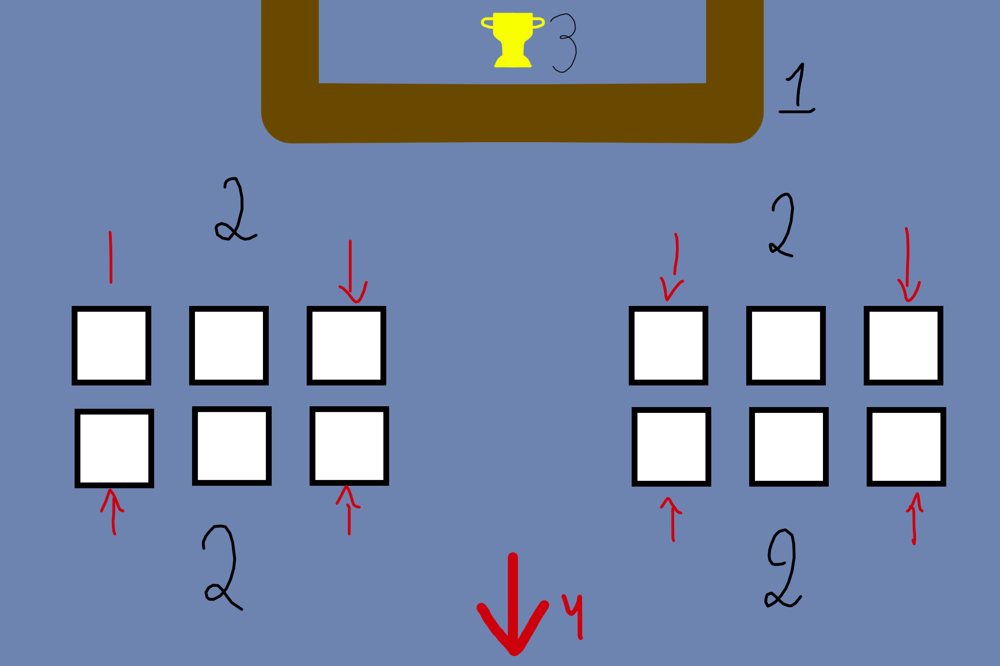

# Projeto Integrador II
*Desenvolvimento de um jogo para a plataforma Game Boy Advance usando linguagem C*

## Motivos
Jogos são do meu interesse e sou dono de um Game Boy Advance SP e desde muito tempo já queria programar um jogo para essa plataforma. No geral jogos envolvem várias tipos de conhecimentos, por exemplo programação, design de imagens e músicas, jogabilidade entre outros.

O Game Boy Advance (GBA) é uma máquina mais poderosa do que pode parecer podendo ser usada para outros propósitos além dos jogos. Essa potência toda devira do fato do GBA ser um dispositivo de baixíssimo nível, tornando a programação complexa e muito dependente dos conhecimentos do hardware.

A linguagem C é uma das mais usadas no mundo e é usada no nosso curso para ensinar os fundamentos de programação. É a melhor linguagem para se programar no GBA devido à proximidade ao hardware, sua eficiência e sua compatibilidade.

## Tecnologias Necessárias
- Emulador:	[mGBA](https://mgba.io)
- SDK: [devkitPro](https://devkitpro.org/)
- Conversor de imagens: [grit](https://www.coranac.com/projects/grit/)
- Dispositivo Físico: Game Boy Advance SP (idêntico ao GBA)
- [Flash Writer](https://shop.insidegadgets.com/product/gbxcart-rw/)
- [Cartucho GBA](https://shop.insidegadgets.com/product/gba-32mb-1mbit-flash-save-with-rtc-flash-cart-works-with-pokemon-games/)

## Objetivos
1. Criar um jogo para a plataforma Game Boy Advance
2. O jogo deve ter uma boa jogabilidade
3. O jogo deve funcionar em um Game Boy Advance original

## Jogo
- Nome: **Arcade Mania** (não confirmado)
- Um logo aparece ao ligar o dispositivo
- O jogo deve ter uma temática de um arcade antigo
- O jogador poderá escolher entre vários minigames do arcade para ganhar tickets
- Tickets podem ser trocados por coisas divertidas como roupas
- Ao juntar uma certa quantidade de tickets o jogador ganha o prêmio final e o jogo acaba

## Fontes de Pesquisa
- Tutorial: [Tonc](https://www.coranac.com/tonc/text/toc.htm)
- Especificações técnicas: [GBATek](http://problemkaputt.de/gbatek.htm), [CowBite](https://www.cs.rit.edu/~tjh8300/CowBite/CowBiteSpec.htm)
- ~~[Programming The Nintendo Game Boy Advance: The Unofficial Guide](http://www.freeinfosociety.com/media/pdf/2901.pdf)~~

## Conceitos
---

### Entrada do Arcade

Entrada para o arcade com a placa com o nome do jogo. Há uma multidão do lado de fora

Uma cutscene pode aparecer para apresentar o campeonato e abrir as portas

---

### Dentro do Arcade

Dentro do arcade tem várias máquinas de jogos clássicos. Cada conjunto tem um jogo diferente

1: Balcão onde o protagonista poderá usar tickets para comprar coisas divertidas

2: Máquinas clássicas. Ao interagir o jogador entrará no jogo daquela máquina

3: Prêmio do final do jogo em display

---

## Falta Fazer
- [x] Criar makefile
- [x] Usar grit no makefile
- [x] Criar a logo inicial
- [ ] Função para agrupar vários tilemaps
- [ ] Definir os minigames com uma descrição de cada um
- [ ] Desenvolver os minigames (...)
- [ ] Criar os gráficos para os minigames
- [ ] Criar música?