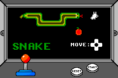
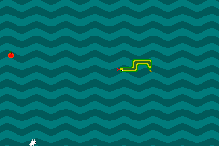
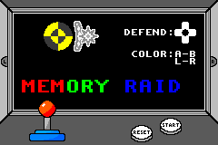
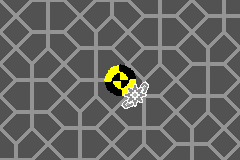
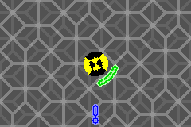
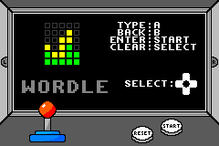
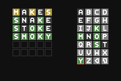

# Projeto Integrador II - Arcade Mania

*Desenvolvimento de um jogo para a plataforma Game Boy Advance usando linguagem C*

> [!NOTE]
> Os detalhes mais técnicos de implementação se encontram no documento entregue à faculdade para conclusão desse trabalho: [DESENVOLVIMENTO DE UM JOGO ELETRÔNICO PARA A PLATAFORMA GAME BOY ADVANCE UTILIZANDO TECNOLOGIAS DISPONÍVEIS SOB LICENÇAS DE CÓDIGO ABERTO](https://1drv.ms/b/s!AvqtUwohgIqOgdIXWNWA-lHjhTkYFw?e=v6Kj00)

> [!WARNING]
> O jogo Wordle foi implementado após a conclusão do trabalho por vontade pessoal e portanto não está presente no documento do trabalho.

Imagens

| Jogo                                                                   | Imagens                                                                                                                                                  |
| ---------------------------------------------------------------------- | -------------------------------------------------------------------------------------------------------------------------------------------------------- |
|            |                                                                                            |
|  |     |
|          |                                                                                      |

## Como experimentar

Baixe a [release mais recente](https://github.com/DaviAMSilva/Arcade_Mania/releases/tag/latest) do arquivo *Arcade_Mania.gba* e instale um emulador do GBA (eu recomendo o [mGBA](https://mgba.io)). Por fim abra o arquivo no emulador e aproveite.

## Motivos

Jogos são do meu interesse e sou dono de um Game Boy Advance SP e desde muito tempo já queria programar um jogo para essa plataforma. No geral jogos envolvem várias tipos de conhecimentos, por exemplo programação, design de imagens e músicas, jogabilidade entre outros.

O Game Boy Advance (GBA) é uma máquina mais poderosa do que pode parecer podendo ser usada para outros propósitos além dos jogos. Essa potência toda vem do fato do GBA ser um dispositivo de baixíssimo nível, tornando a programação complexa e muito dependente dos conhecimentos do hardware.

A linguagem C é uma das mais usadas no mundo e é usada no nosso curso para ensinar os fundamentos de programação. É a melhor linguagem para se programar no GBA devido à proximidade ao hardware, sua eficiência e sua compatibilidade.

## Tecnologias Necessárias

- Emuladores: [mGBA](https://mgba.io)
- SDK: [devkitPro](https://devkitpro.org/)
- Conversor de imagens: [grit](https://www.coranac.com/projects/grit/)
- Dispositivo Físico: Game Boy Advance SP (idêntico ao GBA)
- [Flash Writer](https://shop.insidegadgets.com/product/gbxcart-rw/)
- [Cartucho GBA](https://shop.insidegadgets.com/product/gba-32mb-1mbit-flash-save-with-rtc-flash-cart-works-with-pokemon-games/)

## Objetivos

1. Criar um jogo para a plataforma Game Boy Advance
2. O jogo deve ter uma boa jogabilidade
3. O jogo deve funcionar em um Game Boy Advance original

## Fontes de Pesquisa

- Tutorial: [Tonc](https://www.coranac.com/tonc/text/toc.htm) / [Tonc (Community Edition)](https://github.com/gbadev-org/tonc)
- Especificações técnicas: [GBATek](http://problemkaputt.de/gbatek.htm), [CowBite](https://www.cs.rit.edu/~tjh8300/CowBite/CowBiteSpec.htm)
